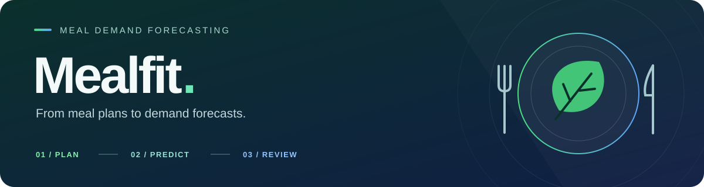
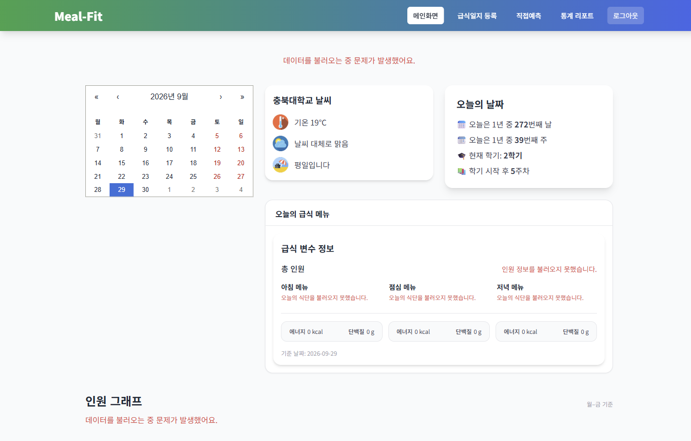
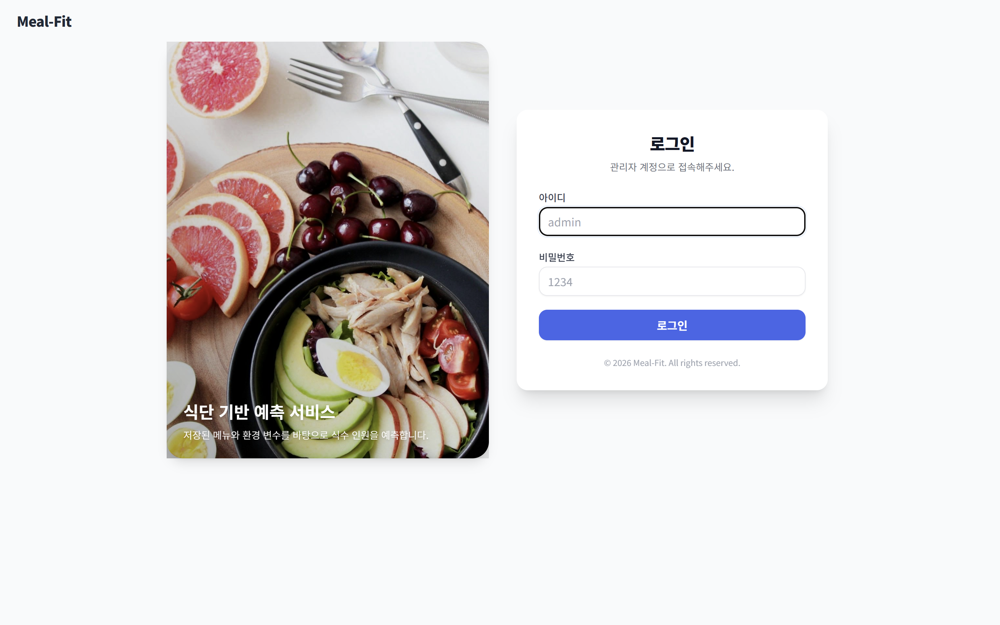
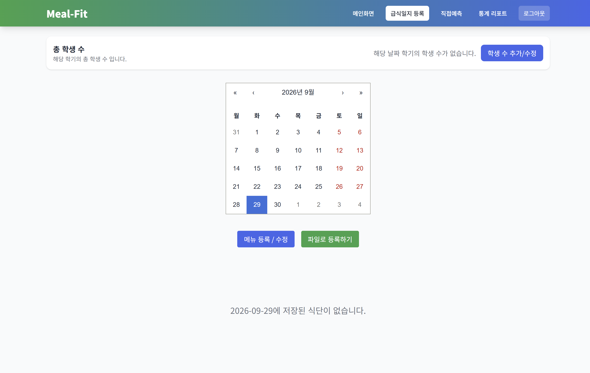
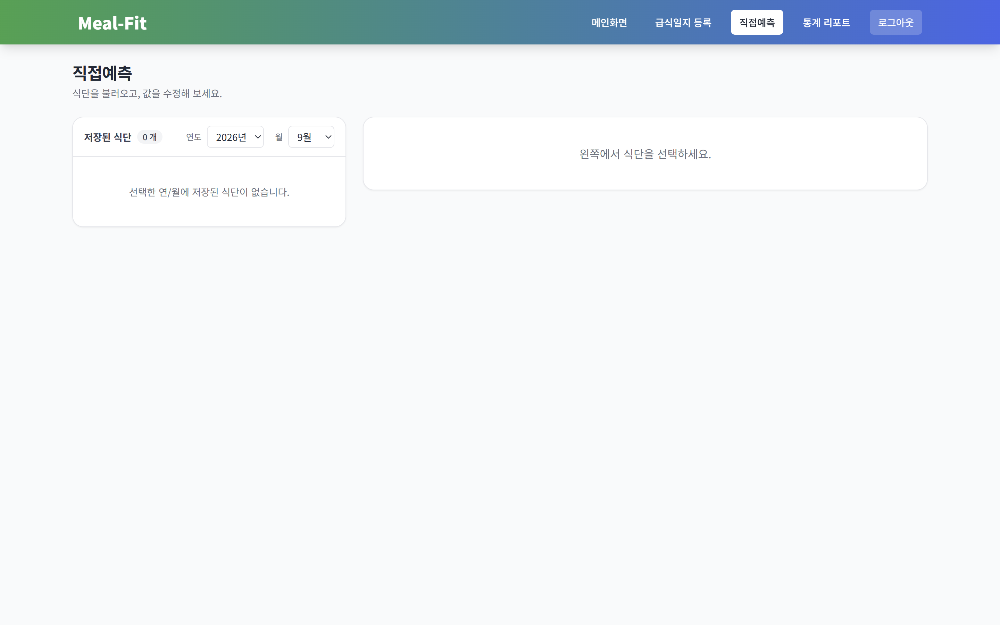
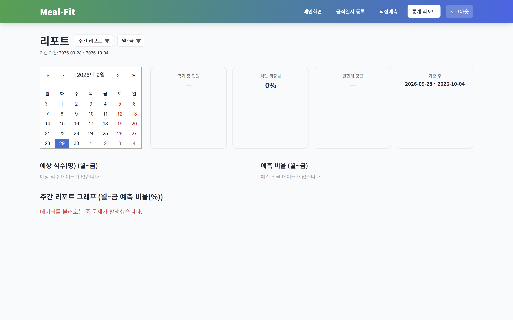
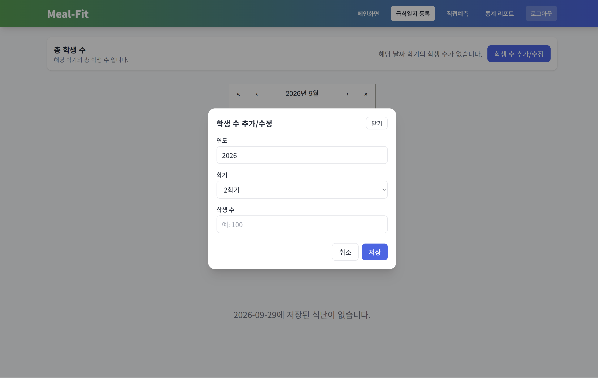
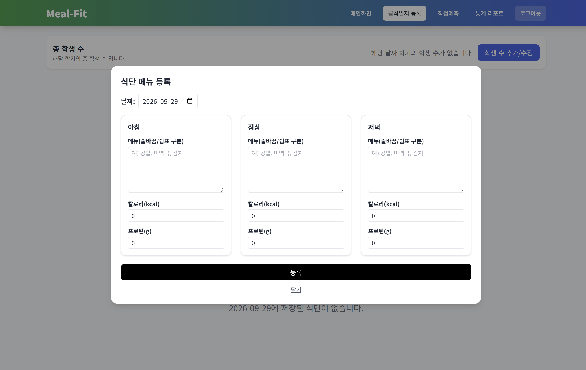
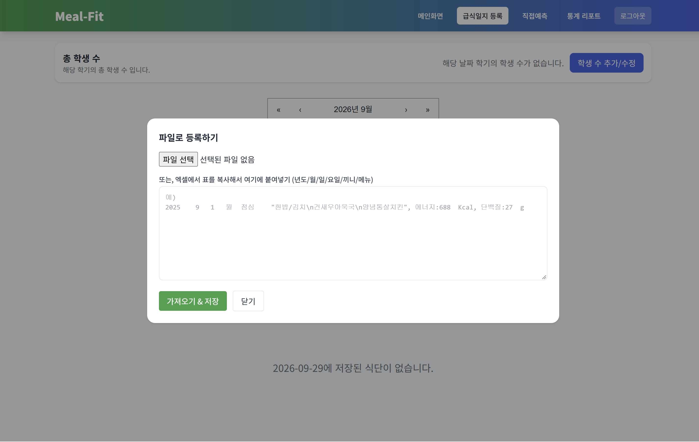
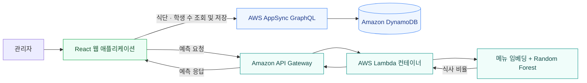

<a id="top"></a>

<p align="center">
  
</p>

<h1 align="center">식단에서 시작하는 급식 수요 예측</h1>

<p align="center">
  <strong>식단 관리 · AI 예측 · 통계 리포트를 연결하는 관리자 웹 애플리케이션</strong>
</p>

<p align="center">
  아침·점심·저녁 메뉴와 영양 정보를 등록하고,<br>
  AI 모델의 식사 비율과 학기별 학생 수를 결합해 예상 식수 인원을 계산합니다.
</p>

<p align="center">
  <a href="#tech-stack">기술 스택</a> &nbsp;·&nbsp;
  <a href="#features">주요 기능</a> &nbsp;·&nbsp;
  <a href="#screenshots">화면 둘러보기</a> &nbsp;·&nbsp;
  <a href="#architecture">시스템 구조</a> &nbsp;·&nbsp;
  <a href="#getting-started">실행 가이드</a> &nbsp;·&nbsp;
  <a href="#documentation">상세 문서</a>
</p>

---

<a id="tech-stack"></a>

## 01. 기술 스택

<table>
  <tr>
    <td width="50%" valign="top">
      <h3>Frontend</h3>
      <p>관리자 화면과 식단 입력 흐름</p>
      
      <br>
      
      
    </td>
    <td width="50%" valign="top">
      <h3>Cloud &amp; API</h3>
      <p>식단·학생 수 저장과 예측 API 연결</p>
      
      <br>
      
      <br>
      
      
    </td>
  </tr>
  <tr>
    <td width="50%" valign="top">
      <h3>AI &amp; ML</h3>
      <p>메뉴 임베딩과 식사 비율 추론</p>
      
      <br>
      
      
    </td>
    <td width="50%" valign="top">
      <h3>Build &amp; Validation</h3>
      <p>추론 컨테이너와 자동 검증 구성</p>
      
      
    </td>
  </tr>
</table>

<details>
<summary>세부 기술과 실행 버전 보기</summary>

| 영역 | 사용 기술 |
| --- | --- |
| 프론트엔드 | React 18, React Router, Tailwind CSS, React Calendar, Google Charts |
| API·데이터 | AWS Amplify Gen 1, AWS AppSync, GraphQL, Amazon DynamoDB |
| 추론 서비스 | Python 3.12, AWS Lambda, Amazon API Gateway, Docker |
| 모델 | scikit-learn Random Forest, PyTorch 임베딩, NumPy, joblib |
| 자동 검증 구성 | GitHub Actions, React Scripts, Python unittest, 모델 SHA-256 체크섬 |

</details>

<a id="features"></a>

## 02. 주요 기능

<table>
  <tr>
    <th width="33%">01 &nbsp; 식단 준비</th>
    <th width="34%">02 &nbsp; 수요 예측</th>
    <th width="33%">03 &nbsp; 결과 확인</th>
  </tr>
  <tr>
    <td align="center">학기별 학생 수 설정<br>메뉴 직접 입력 · 파일 일괄 등록</td>
    <td align="center">메뉴와 환경 변수 조정<br>식사 비율 → 예상 식수 인원</td>
    <td align="center">날짜별 대시보드<br>주간 · 월간 · 학기별 리포트</td>
  </tr>
</table>

| 기능 | 구현 내용 |
| --- | --- |
| 식단 관리 | 달력에서 날짜를 선택해 끼니별 메뉴·칼로리·단백질 등록 및 수정 |
| 일괄 등록 | 지정된 열 형식의 TSV·CSV·TXT 파일 업로드, 엑셀 표를 복사한 텍스트 붙여넣기 |
| 학생 수 관리 | 연도와 학기별 총 학생 수 등록 및 수정 |
| 직접 예측 | 저장된 식단을 선택하고 메뉴·영양 정보·요일·공휴일·시험 여부·총인원을 조정해 예측 요청 |
| 대시보드 | 날짜별 예상 식수, 급식 메뉴, 날씨 및 주간 인원 그래프 조회 |
| 통계 리포트 | 주간·월간·학기별 조회, 주말 포함 여부 선택, 예상 식수·예측 비율 표와 그래프 표시 |

기본 사용 흐름은 **학생 수 등록 → 식단 입력 → 식사 비율 예측 → 예상 인원 및 리포트 확인**입니다. 데이터 저장·조회에는 AppSync 연결이, 모델 추론에는 예측 API 연결이 필요합니다.

<a id="screenshots"></a>

## 03. 화면으로 보는 Mealfit

> **캡처 환경** · 실제 React 앱을 AWS 예제 설정으로 로컬 실행했습니다. 백엔드 미연결로 저장된 식단·예측 결과가 없으며 일부 조회 오류가 표시됩니다. 운영 데이터나 모델 성능을 보여주는 화면은 아닙니다.

### 메인 대시보드

달력에서 날짜를 선택하고 예상 식수 인원, 끼니별 메뉴, 날씨와 주간 추이를 확인합니다. `/`

<a href="docs/images/screenshots/dashboard.png">
  
</a>

### 페이지 둘러보기

전체 **5개 페이지**를 담았습니다. 이미지를 누르면 원본 크기로 볼 수 있습니다.

<table>
  <tr>
    <td width="50%" valign="top">
      <h4>관리자 로그인</h4>
      <a href="docs/images/screenshots/login.png"></a>
      <p><code>/login</code><br>데모 계정으로 관리자 화면에 진입합니다.</p>
    </td>
    <td width="50%" valign="top">
      <h4>급식일지 등록</h4>
      <a href="docs/images/screenshots/meal-log.png"></a>
      <p><code>/meal-log</code><br>학기별 학생 수를 관리하고, 날짜별 식단을 등록·수정합니다.</p>
    </td>
  </tr>
  <tr>
    <td width="50%" valign="top">
      <h4>직접예측</h4>
      <a href="docs/images/screenshots/direct-prediction.png"></a>
      <p><code>/saved-meals</code><br>저장된 식단을 선택해 입력값을 조정하고 예측을 요청합니다.</p>
      <p><sub>캡처는 목록이 비어 있는 상태입니다. 식단 선택 후의 편집 폼과 예측 결과는 포함하지 않습니다.</sub></p>
    </td>
    <td width="50%" valign="top">
      <h4>통계 리포트</h4>
      <a href="docs/images/screenshots/report.png"></a>
      <p><code>/report</code><br>주간·월간·학기별 예상 식수와 예측 비율을 표와 그래프로 확인합니다.</p>
    </td>
  </tr>
</table>

<details>
<summary>급식일지 입력 팝업 3종 보기 — 학생 수 · 메뉴 · 파일 등록</summary>

#### 학생 수 추가·수정

연도와 학기를 선택하고 예측 계산에 사용할 총 학생 수를 입력합니다. 아래 화면은 저장 전 입력 폼입니다.



#### 식단 메뉴 등록

선택한 날짜의 아침·점심·저녁별 메뉴, 칼로리, 단백질을 입력합니다. 아래 화면은 저장 전 입력 폼입니다.



#### 파일로 식단 등록

TSV·CSV·TXT 파일을 업로드하거나 엑셀 표를 복사한 텍스트를 붙여넣어 식단을 일괄 입력합니다.



</details>

<a id="architecture"></a>

## 04. 시스템 구조

**데이터 관리와 모델 추론을 나눠 연결합니다.** 식단·학생 수는 GraphQL로 관리하고, 모델 예측은 별도의 HTTP API로 요청합니다.



### 구현에서 살펴볼 부분

| 구현 포인트 | 저장소에서 확인할 내용 |
| --- | --- |
| 기능 단위 프론트엔드 | `src/features` 아래에 인증·식단·대시보드·리포트의 화면과 로직 배치 |
| 독립된 추론 실행 환경 | [예측 서비스](services/prediction/README.md)에 코드·모델·의존성·Dockerfile을 함께 관리 |
| 명시적인 모델 입력 규격 | [모델 명세](services/prediction/models/model-manifest.json)에 수치 특성 수·임베딩 차원·최대 토큰 수 기록 |
| 자동 검증 구성 | [CI 워크플로](.github/workflows/ci.yml)에 프론트엔드 빌드·Python 테스트·모델 체크섬 확인 정의 |

### 예측 방식

1. 메뉴 텍스트를 최대 20개 토큰으로 변환하고, 32차원 임베딩의 평균을 구합니다.
2. 영양 정보와 학기 진행률을 스케일링하고, 요일·끼니·공휴일·시험 관련 13개 수치 특성과 결합합니다.
3. Random Forest 모델이 **식사 비율**을 반환합니다.
4. 프론트엔드가 식사 비율과 해당 학기의 학생 수를 곱해 **예상 식수 인원**을 표시합니다.

모델 입력 규격과 아티팩트 버전은 [모델 명세](services/prediction/models/model-manifest.json), 실행 방식은 [예측 서비스 문서](services/prediction/README.md)에서 확인할 수 있습니다.

<details>
<summary>디렉터리 구성과 모듈 경계 보기</summary>

```text
src/
├── app/                     라우팅과 최상위 Provider
├── features/                기능별 화면·컴포넌트·API
│   ├── auth/                데모 로그인과 보호 라우트
│   ├── dashboard/           대시보드와 전용 카드
│   ├── meals/               식단 등록·파일 입력·직접 예측 화면
│   ├── people/              학기별 학생 수 관리
│   ├── prediction/          예측 API 클라이언트
│   └── reports/             통계 리포트
├── shared/                  공통 UI·레이아웃·날짜 유틸리티
└── graphql/                 Amplify가 생성한 GraphQL 코드
amplify/                     AWS 백엔드 인프라 정의
services/prediction/         추론 코드·모델·Dockerfile·테스트
ml/                          모델 추론 검증 노트북
docs/                        아키텍처·배포 문서와 화면 캡처
```

프론트엔드, 인프라, 추론 서비스, 모델 실험의 책임을 나눠 관리합니다. 프론트엔드 import는 `jsconfig.json`에 설정한 `src` 기준 절대 경로를 사용합니다. 자세한 경계와 데이터 흐름은 [아키텍처 문서](docs/architecture.md)를 참고하세요.

</details>

<a id="getting-started"></a>

## 05. 실행 가이드

**필요 환경:** Node.js 20 이상, npm · **접속 주소:** `http://localhost:3000` · **데모 계정:** `admin / 1234`

<details>
<summary><strong>화면만 확인하기 — AWS 연결 없이 실행</strong></summary>

먼저 `npm ci`로 의존성을 설치합니다. 실제 AWS 설정이 없는 새 체크아웃에서는 예제 파일을 복사해 UI를 실행할 수 있습니다. 기존 환경에서 생성한 `src/aws-exports.js`가 있다면 덮어쓰지 마세요.

```powershell
# Windows PowerShell
Copy-Item src/aws-exports.example.js src/aws-exports.js
npm start
```

```bash
# macOS / Linux
cp src/aws-exports.example.js src/aws-exports.js
npm start
```

로그인과 화면 이동, 입력 폼을 확인할 수 있습니다. 식단·학생 수의 저장 및 조회, 모델 예측은 실제 백엔드를 연결해야 동작합니다. 위 캡처도 예제 설정을 사용한 상태입니다.

</details>

<details>
<summary><strong>전체 기능 실행하기 — AWS 및 예측 API 연결</strong></summary>

#### 1. 준비 사항

- Node.js 20 이상과 npm
- AWS 기능 사용 시 Amplify CLI 및 연결할 AWS 환경의 접근 권한
- 예측 서비스 테스트 시 Python 3.12, 컨테이너 빌드 시 Docker

저장소 루트에서 의존성을 설치합니다.

```bash
npm ci
```

#### 2. AWS 및 환경변수 설정

연결할 Amplify 환경을 선택해 `src/aws-exports.js`를 생성합니다.

```bash
amplify pull
```

`.env.example`을 `.env.local`로 복사합니다.

```powershell
# Windows PowerShell
Copy-Item .env.example .env.local
```

```bash
# macOS / Linux
cp .env.example .env.local
```

`.env.local`의 `REACT_APP_PREDICTION_API_URL`을 실제 예측 API의 POST 엔드포인트로 설정합니다. 예제에 있는 주소는 실행 가능한 서비스 주소가 아닙니다.

#### 3. 프론트엔드 실행

```bash
npm start
```

기본 주소는 `http://localhost:3000`입니다. 현재 코드에 포함된 데모 로그인은 **아이디 `admin` / 비밀번호 `1234`**입니다.

</details>

## 06. 검증과 배포

| 명령 | 확인 범위 |
| --- | --- |
| `npm run test:ci` | 프론트엔드 테스트 실행. 현재 스크립트는 테스트 파일이 없어도 통과하도록 설정됨 |
| `npm run build` | 프론트엔드 프로덕션 빌드. `src/aws-exports.js` 필요 |
| `npm run test:prediction` | Python `unittest` 실행. 현재 테스트는 CORS 응답과 JSON 직렬화 확인 |
| `npm run check` | 위 프론트엔드 테스트·빌드·예측 서비스 테스트를 순서대로 실행 |

`test:prediction`은 `python3` 명령을 사용합니다. Windows에서 `python3`를 사용할 수 없다면 `python -m unittest discover -s services/prediction/tests`로 개별 실행할 수 있습니다.

[CI 워크플로](.github/workflows/ci.yml)는 PR과 `main` 브랜치 push 시 프론트엔드 테스트·빌드, Python 테스트, 모델 체크섬 확인을 수행하도록 구성되어 있습니다. 모델 추론 정확도나 AWS 배포 성공까지 검증하는 구성은 아닙니다.

예측 서비스 컨테이너는 저장소 루트에서 빌드합니다.

```bash
docker build -t mealfit-prediction services/prediction
```

Amplify 백엔드 배포와 ECR·Lambda 이미지 갱신 절차는 [배포 문서](docs/deployment.md)를 참고하세요.

## 07. 구현 범위와 다음 과제

- **인증:** 현재 로그인은 프론트엔드 로컬 상태와 `localStorage`를 사용하는 데모 구현입니다. 운영용 접근 제어에는 Cognito 같은 서버 검증형 인증이 필요합니다.
- **모델 재현:** 저장된 모델과 추론 검증 노트북을 포함합니다. 전체 데이터 준비·학습·평가 파이프라인과 정량 성능 지표는 이 저장소에서 제공하지 않습니다.
- **운영 검증:** 예측 컨테이너 통합 테스트와 자동 배포 파이프라인은 추가 개선 과제입니다.

<a id="documentation"></a>

## 08. 더 살펴보기

| 문서 | 내용 |
| --- | --- |
| [아키텍처](docs/architecture.md) | 모듈별 책임, 데이터 흐름, 설정 원칙 |
| [배포](docs/deployment.md) | Amplify 및 예측 서비스 배포 절차 |
| [예측 서비스](services/prediction/README.md) | 추론 코드 구성, 테스트, 컨테이너 빌드 |
| [모델 실험](ml/README.md) | 노트북의 역할과 재학습 파이프라인의 현재 범위 |

---

<p align="center">
  <strong>Mealfit</strong><br>
  식단 관리에서 수요 예측까지<br><br>
  <a href="#top">맨 위로 돌아가기 ↑</a>
</p>
